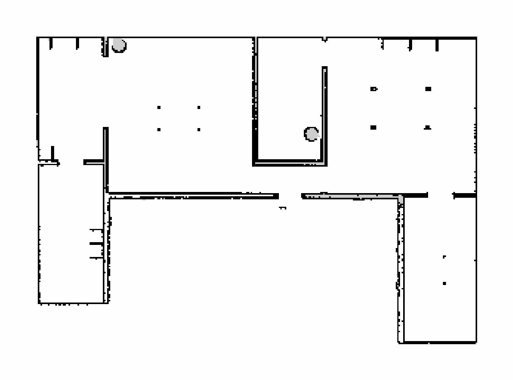
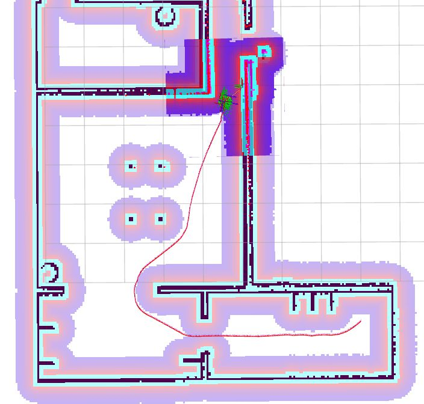
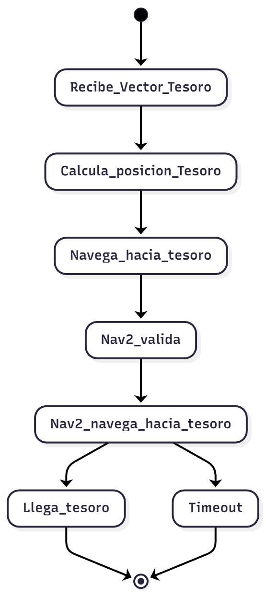

# Sistema de Navegación Autónoma con ROS2 y Turtlebot3

**Jefferson Paul Caiza Jami**
**Pablo Granell Robles**


## 1. Objetivos Principales

El trabajo se estructura en tres tareas que crean un sistema de navegación autónomo completo:

1. **Mapeo del entorno (Tarea 0):** Crear un mapa de la casa simulada utilizando SLAM
2. **Servicio de comandos de navegación (Tarea 1):** Desarrollar un servicio ROS2 que permita comandar al robot a que haga patrullaje por la casa o que vuelva a la salida
3. **Búsqueda del tesoro con patrullaje (Tarea 2):** Implementar un comportamiento autónomo de búsqueda y navegación hacia un "tesoro" basado en la información recibida

## 2. Estructura del Sistema

### 2.1 Organización del Proyecto

```
Entregable-ARO/
|- src/                                 # Código fuente
|   |- servicio_comandos/               # Paquete Tarea 1
|   |   |- servicio_comandos/
|   |       |- servidor_comandos.py
|   |       |- cliente_comandos.py
|   |- busqueda_tesoro/                 # Paquete Tarea 2
|   |   |- busqueda_tesoro/
|   |   |   |- busqueda_nodo.py
|   |   |- config/
|   |       |- turtlebot3_params.yaml   # Parámetros del robot
|   |   |minimal_interfaces/              # Interfaces personalizadas
|   |   |-srv/
|   |       |- ComandoNavegacion.srv     # Definición del servicio
|   |- minimal_interfaces/              # Interfaces personalizadas
|- mapas/                               # Mapas generados
|   |- casa_map.pgm
|   |- casa_map.yaml
|- scripts/                             # Scripts de automatización
    |- setup_env.sh                     # Configuración del entorno
    |- paso1_gazebo.sh                  # Lanzamiento de Gazebo
    |- paso2_slam.sh                    # Lanzamiento de SLAM
    |- paso3_nav.sh                     # Lanzamiento de Nav2
    |- paso4_rviz.sh                    # Lanzamiento de RViz
    |- paso5_mapa.sh                    # Guardado del mapa
    |- gazebo_cliente.sh                # Lanzamiento de la interfaz de gazebo
    |- ejecutar_todo.sh                 # Script completo para Tarea 1
    |- ejecutar_todo2.sh                # Script completo para Tarea 2
```

### 2.3 Diagrama de Componentes


## 3. Tarea 0: Mapeo de la Casa

### 3.1 Objetivo
Generar un mapa 2D del entorno simulado de la casa utilizando SLAM y Nav2 para ayudar a navegarla. Luego editar el mapa si fuera necesario para limpiarlo y dejarlo preparado para las tareas posteriores.

### 3.2 Proceso de Mapeo

**Ejecución de Gazebo**
Primero necesitamos ejecutar el servidor de Gazebo con el mundo de la casa:
```bash
./scripts/paso1_gazebo.sh
```

**Ejecución del SLAM**
Luego necesitamos iniciar el proceso de SLAM para empezar a mapear el entorno y que el robot se pueda ubicar:
```bash
./scripts/paso2_slam.sh
```

**Ejecución de Nav2**
Luego tenemos que iniciar el stack de navegación Nav2 para controlar el robot durante la exploración y que así sea más sencillo recorrer la casa:
```bash
./scripts/paso3_nav.sh
```

**Ejecución de Rviz**
Finalmente, lanzamos RViz para visualizar el proceso de mapeo en tiempo real y asi poder seleccionar los puntos de exploración:
```bash
./scripts/paso4_rviz.sh
```

Nos aseguraremos de que el robot explore toda la casa siguiendo estas pautas:

- Cobertura completa de todas las habitaciones
- Múltiples pasadas por varias habitaciones para reducir el ruido

**Guardado del Mapa**

Una vez completada la exploración tenemos que guardar el mapa generado con el siguiente comando:
```bash
./scripts/paso5_mapa.sh
```

Esto genera dos archivos:
- **casa_map.pgm:** Imagen del mapa en formato PGM (escala de grises)
- **casa_map.yaml:** Metadatos del mapa con parámetros de configuración

### 3.3 Parámetros y mapa Final

```yaml
image: casa_map.pgm
mode: trinary
resolution: 0.05        # 5 cm por píxel
origin: [-8.79, -6.42, 0]  # Posición del origen en metros
occupied_thresh: 0.65   # Umbral para celdas ocupadas
free_thresh: 0.25       # Umbral para celdas libres
```


### 3.4 Problemas Encontrados y Soluciones

**Problema 1:** Mapa inicial muy pequeño

- **Causa:** Las zonas de fuera no se exploraban

- **Solución:** Ajustes con GIMP para ampliar el tamaño del mapa

**Problema 2:** Paredes no completas y zonas grises

- **Causa:** Ruido en el SLAM

- **Solución:** Ajuste manual en GIMP para limpiar el mapa y asegurar paredes completas

## 4. Tarea 1: Servicio de Comandos de Navegación

### 4.1 Objetivo
Desarrollar un servicio ROS2 que permita enviar comandos de navegación al robot, abstrayendo la complejidad del stack Nav2. La implementacion inicial incluye el comando de patrullaje y retorno a la salida.

### 4.2 Definición del Servicio
Se creó una interfaz personalizada `ComandoNavegacion.srv`:

```python
# Solicitud del servicio
string comando  # "Patrullar" o "GoToExit"

# Respuesta del servicio
bool exito
string mensaje
```

### 4.3 Implementación del Servidor

**Estructura del Servidor (`servidor_comandos.py`)**

```python
class ServidorComandos(Node):
    def __init__(self):
        super().__init__('servidor_comandos')
        # Crear el servidor ROS2 para recibir los comandos
        # Inicializa el navigator Nav2 para control del robot
```

**Comandos Implementados**

1. **Salida:** Retorno al origen
   - Navega a un punto establecido justo fuera de la puerta
   - Punto de referencia conocido

2. **Patrullar:** Patrullaje continuo por waypoints predefinidos
   - Ciclo infinito por puntos predefinidos
   - Se detiene cuando el cliente para


**Arbol de decisiones de los comandos**

```python
def comando_callback(self, request, response):
    ...
    # Arbol de decisiones para enrutar los comandos a funciones específicas
    if request.comando == "Patrullar":
        response.exito, response.mensaje = self.patrullar()
    elif request.comando == "GoToExit":
        response.exito, response.mensaje = self.ir_a_salida()
    ...
```


### 4.4 Problemas Encontrados y Soluciones

**Problema 1:** Comando Patrullar paraba tras una iteración

- **Causa:** No se gestionaba el ciclo continuo

- **Solución:** Implementar flag `self.patrullando` y bucle infinito

**Problema 2:** Puntos de patrullaje o salida incorrectos

- **Causa:** Puntos descolocados en base al mapa

- **Solución:** Ajuste manual de coordenadas tras pruebas

## 5. Tarea 2: Búsqueda del Tesoro con Patrullaje

### 5.1 Objetivo
Desarrollar un nodo autónomo que busca un "tesoro" por dentro o fuera de la casa y llega a el en menos de 90 segundos. Para ello lee la informacion del nodo_tesoro y se basa a partir de esa informacion para localizarlo y acercarse a el.

### 5.2 Estrategia de Búsqueda

**Algoritmo de Detección**

El tesoro se calcula con los siguientes pasos:

- Se calcula la posicion actual del robot

- Se recibe el vector de distancia del tesoro y se guarda

- Se suma el vector de distancia a la posición del robot para obtener la posición del tesoro

- La posicion de tesoro aproximada será la posición del robot más el vector de distancia al tesoro


### 5.3 Acercamiento al Tesoro

Una vez se recibe informacion sobre el tesoro:

1. **Cálculo de posición global:** Utiliza SLAM para localizar el robot en el mapa
2. **Navegación hacia el tesoro:** Envía un goal a Nav2 con la posición estimada del tesoro
3. **Monitoreo continuo:** Nav2 navega autónomamente hacia el tesoro, evitando los obstáculos y planificando automáticamente la ruta.
4. **Tesoro:** El tesoro se considera encontrado al estar a < 0.5m del mismo.

**Resumen del del Sistema**

{width=30%}

### 5.6 Problemas Encontrados y Soluciones

**Problema 1:** Problemas si el tesoro estaba dentro de la casa

- **Causa:** El tesoro puede aparecer dentro de la casa y puede haber paredes entre el robot y el tesoro

- **Solución:** Utilizar Nav2 en vez de mover directamente el robot para asi utilizar la planificación de rutas de Nav2

**Problema 2:** Robot no podia navegar por fuera de la casa

- **Causa:** No habia suficientes caracteristicas en el mapa para que el SLAM funcionara bien

- **Solución:** Modificar los ajustes del SLAM para mejorar la localización con menos características en exteriores.


## 6. Scripts de Automatización

Para facilitar la ejecución y pruebas del sistema, se desarrollaron varios scripts bash que automatizan el lanzamiento de componentes.

### 6.1 Scripts Principales

**`setup_env.sh`**
Configura el entorno ROS2:
```bash
#!/bin/bash
source /opt/ros/humble/setup.bash
source ~/turtlebot3_ws/install/setup.bash
export TURTLEBOT3_MODEL=waffle_pi
export GAZEBO_MODEL_PATH=$GAZEBO_MODEL_PATH:~/Entregable-ARO/models
```

**`paso1_gazebo.sh`**
Lanza Gazebo con el mundo de la casa:
```bash
ros2 launch turtlebot3_gazebo turtlebot3_house.launch.py
```

**`paso2_slam.sh`**
Inicia SLAM para mapeo:
```bash
ros2 launch slam_toolbox online_async_launch.py use_sim_time:=true
```

**`paso3_nav.sh`**
Lanza el stack de navegación Nav2:
```bash
ros2 launch turtlebot3_navigation2 navigation2.launch.py use_sim_time:=True map:=./mapas/casa_map.yaml
```

**`ejecutar_todo.sh`**
Script maestro que lanza todo el sistema necesario para la Tarea 1.
Compila ademas el workspace antes de lanzar todo.
Para asegurarse de que el servidor de Gazebo esté listo antes de iniciar SLAM y Nav2, incluye una barrera que se sobrepasa pulsando ENTER.

**`ejecutar_todo2.sh`**
Script maestro que lanza todo el sistema necesario para la Tarea 2.
Compila ademas el workspace antes de lanzar todo.
Para asegurarse de que el servidor de Gazebo esté listo antes de iniciar SLAM y Nav2, incluye una barrera que se sobrepasa pulsando ENTER.

## 7. Configuración y Parámetros

### 7.1 Configuración del Robot

#### 7.1.1 `turtlebot3_params.yaml`
```yaml
robot:
  # Dimensiones físicas
  radius: 0.220
  wheel_base: 0.287
  
  # Límites de velocidad
  max_linear_vel: 0.26
  max_angular_vel: 1.82
  
  # Aceleraciones
  linear_acc: 2.5
  angular_acc: 3.2
  
  # Sensor láser
  laser:
    min_range: 0.12
    max_range: 3.5
    min_angle: -3.14159
    max_angle: 3.14159
    samples: 360
```

### 7.2 Parámetros de Navegación

```yaml
nav2:
  # Planner
  planner:
    plugin: "nav2_navfn_planner/NavfnPlanner"
    tolerance: 0.5
    use_astar: false
    
  # Controller
  controller:
    plugin: "nav2_regulated_pure_pursuit_controller"
    desired_linear_vel: 0.25
    max_linear_accel: 2.5
    lookahead_dist: 0.6
    
  # Recovery behaviors
  recovery:
    - spin
    - backup
    - wait
```

## 9. Conclusiones

El proyecto ha cumplido satisfactoriamente todos los objetivos planteados:

**Tarea 0:** Mapa completo y preciso de la casa generado con SLAM

**Tarea 1:** Servicio de comandos funcional con 8 comandos implementados  

**Tarea 2:** Sistema autónomo de búsqueda con patrullaje efectivo

## Anexos

### A. Comandos de Ejecución

```bash
# Compilar workspace
colcon build --symlink-install -package-select servicio_comandos busqueda_tesoro minimal_interfaces

# Lanzar sistema completo para la tarea 1
cd ~/Entregable-ARO
./scripts/ejecutar_todo.sh

# Ejecutar cliente de comandos
ros2 run servicio_comandos cliente_comandos Patrullar

# Lanzar sistema completo para la tarea 2
cd ~/Entregable-ARO
./scripts/ejecutar_todo2.sh
```